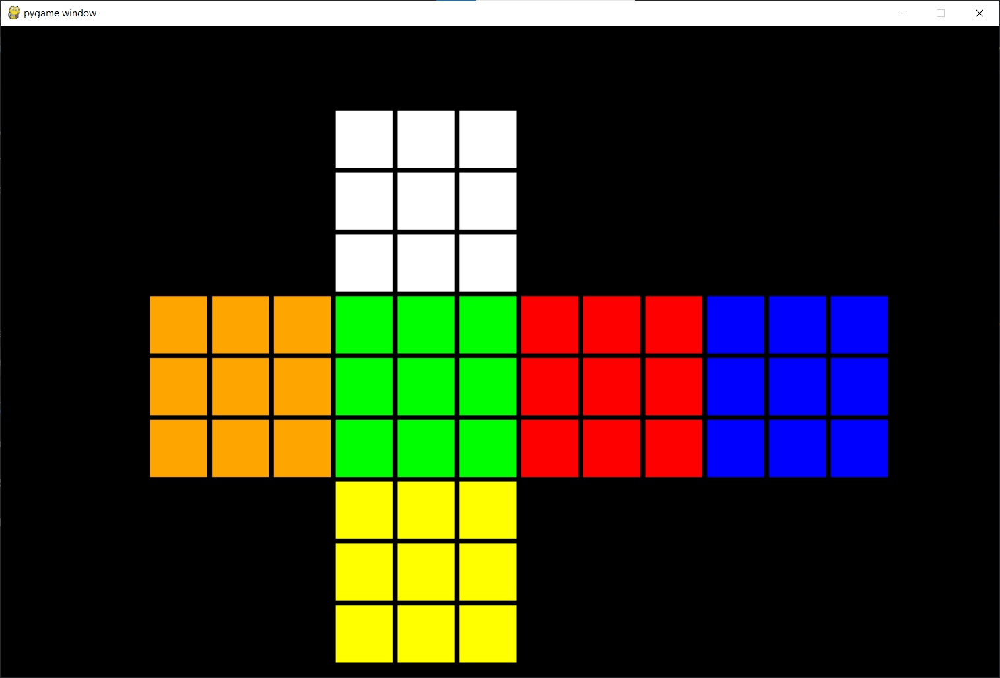

# Rubix Solver 🎮




Rubix Solver is a GUI based application made using Pygame for rendering controls. 

## Setting up the Game 🛠
For playing the game first you need install some requirements by using the following commands:
```python
pip install -r requirements.txt
```
After doing this there might be some versions conflicts due to python versions. So, it is recommended to use virtual environment for error free experience. For installing virtual environment you could either use:
- virtual environment package <br>
For activating virtual environment use:
```python
.\your_virtual_environment_name\Scripts\activate
```
- anaconda environment <br>
For activating ananconda environment use:
```python
conda activate your_virtual_environment_name
```
<br>

## Running up of Game 👨🏻‍💻

For playing this game you need to run the following command:
```python
python3 -m src.main
```
**Note** - If error like 
```Python was not found; run without arguments to install from the Microsoft Store, or disable this shortcut from Settings > Manage App Execution Aliases.``` appears then simply run 
```python
python -m src.main
```

## Controls 🕹

| Faces | Buttons | 
|-------|---------|
| Front | Press F |
| Back  | Press B |
| Up    | Press U |
| Down  | Press D |
| Right | Press R |
| Left  | Press L |

## Getting Solution 🚩

For getting the solution of the scrambled cube wee need run:
```python
python -m src.stats.statistics
```
This command basically creates an excel sheet which you can open in your device for checking the solution.  
 ## Technologies Used 🛠

<a href="#"></a>
<a href="#"></a>
